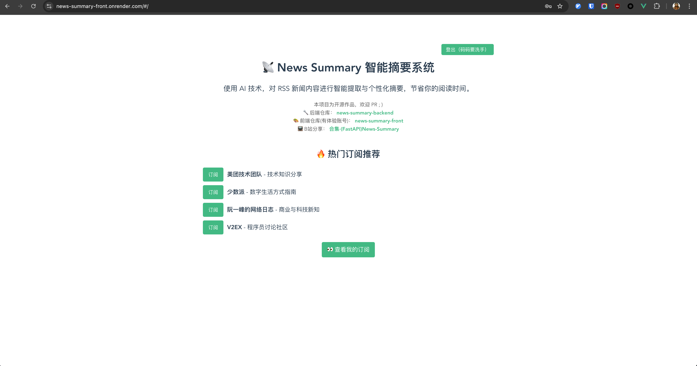
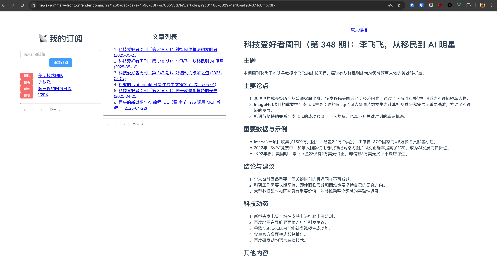

# News-Summary-Front

Vue3 实现的 News-summary 前端项目

## 线上体验地址(MVP版本，持续升级中...)

- <https://news-summary-front.onrender.com/>

`注册` 或者使用如下用户名密码登录体验

- username: 码码要洗手
- password: Mmyxs;!1

## Depends

- vue3
- ts
- pinia
- vue-router
- element-plus
- axios

## .env

```.env
VITE_API_BASE_URL=http://localhost:8000
```

## Run

`npm run dev`

## MVP





## backend

[news-summary](https://github.com/wsgggws/news-summary)
